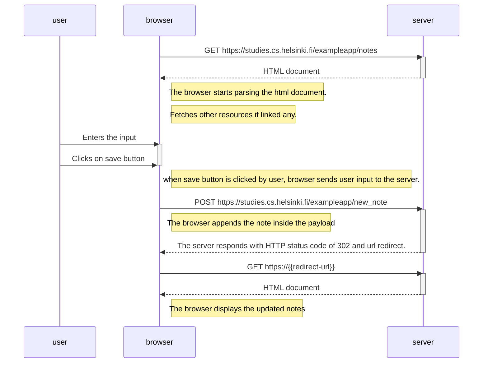

```mermaid
  sequenceDiagram
    participant user
    participant browser
    participant server

    browser->>server: GET https://studies.cs.helsinki.fi/exampleapp/notes
    activate server
    server-->>browser: HTML document
    deactivate server
    Note right of browser: The browser starts parsing the html document.
    Note right of browser: Fetches other resources if linked any.

    user->>browser: Enters the input
    activate browser
    user->>browser: Clicks on save button
    deactivate browser
    Note right of browser: when save button is clicked by user, browser sends user input to the server.

    browser->>server: POST https://studies.cs.helsinki.fi/exampleapp/new_note
    activate server
    Note right of browser: The browser appends the note inside the payload
    server-->>browser: The server responds with HTTP status code of 302 and url redirect.
    deactivate server

    browser->>server: GET https://{{redirect-url}}
    activate server
    server-->>browser: HTML document
    deactivate server
    Note right of browser: The browser displays the updated notes
```
