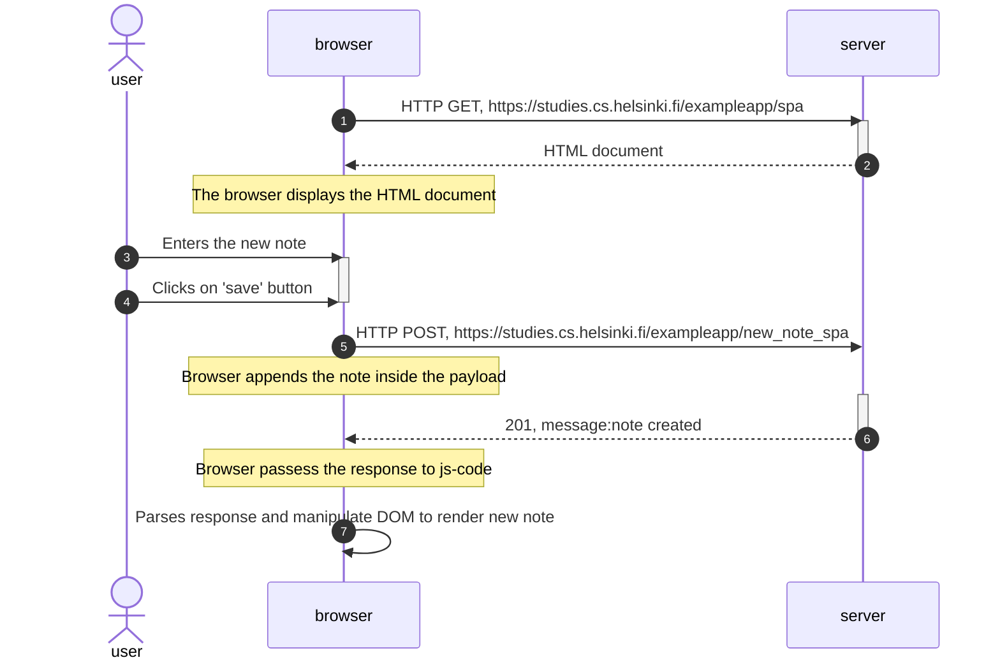

```mermaid

  sequenceDiagram
    autonumber
    actor user
    participant browser
    participant server

    browser->>server: HTTP GET, https://studies.cs.helsinki.fi/exampleapp/spa
    activate server
    server-->>browser: HTML document
    deactivate server
    Note over browser: The browser displays the HTML document

    user->>browser: Enters the new note
    activate browser
    user->>browser: Clicks on 'save' button
    deactivate browser

    browser->>server: HTTP POST, https://studies.cs.helsinki.fi/exampleapp/new_note_spa
    Note over browser: Browser appends the note inside the payload
    activate server
    server-->>browser: 201, message:note created
    deactivate server
    Note over browser: Browser passess the response to js-code

    browser->>browser: Parses response and manipulate DOM to render new note


```
