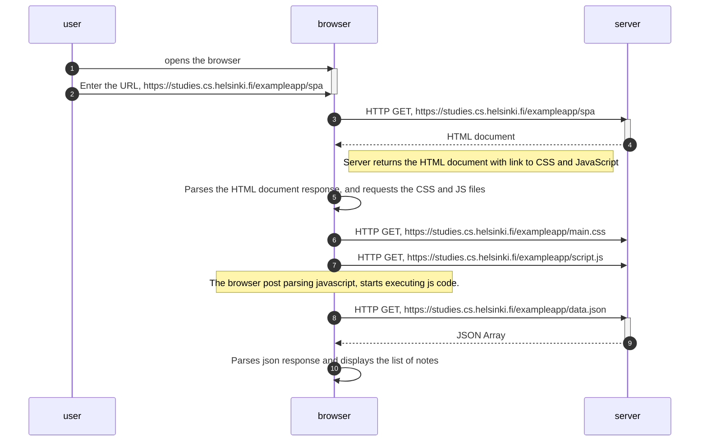

```mermaid

  sequenceDiagram
    autonumber
    participant user
    participant browser
    participant server

    user->>browser: opens the browser
    activate browser
    user->>browser: Enter the URL, https://studies.cs.helsinki.fi/exampleapp/spa
    deactivate browser

    browser->>server: HTTP GET, https://studies.cs.helsinki.fi/exampleapp/spa
    activate server
    server-->>browser: HTML document
    deactivate server
    Note left of server: Server returns the HTML document with link to CSS and JavaScript

    browser->>browser: Parses the HTML document response, and requests the CSS and JS files

    browser->>server: HTTP GET, https://studies.cs.helsinki.fi/exampleapp/main.css
    browser->>server: HTTP GET, https://studies.cs.helsinki.fi/exampleapp/script.js

    Note over browser: The browser post parsing javascript, starts executing js code.

    browser->>server: HTTP GET, https://studies.cs.helsinki.fi/exampleapp/data.json
    activate server
    server-->>browser: JSON Array
    deactivate server

    browser->>browser: Parses json response and displays the list of notes
```
